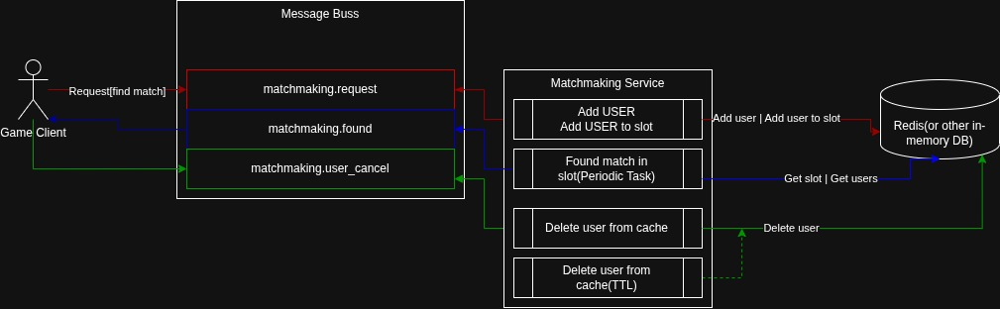

# PART A
## SERVICE DESIGN

#### Short Description 
In my opinion, this should be a separate system that subscribes to the necessary topics as a consumer group
in the message bus (for example, Kafka). To enable horizontal scaling,
it will be a microservice with shared state between different pods or process. For this purpose, we can use an in-memory
database such as Redis.

Users will send messages to the message bus with requests for match registration, and then wait for a response
from the system. Registered users will be added to a hash map in Redis, and if a delete or cancel request comes,
we will remove them.

To divide users into matches and teams, we will first register them into corresponding skill slots,
grouped by their skill rating (for example, each slot represents a 50-point range — 1–50, 51–100, 101–150, and so on).
To speed up the search, we can also use users from neighboring slots, although this approach can create conflicts
if the same player is already being used in another match. This is why atomic operations
(for example, using Lua scripts in Redis) should be used to “claim” players safely.

Every few seconds (for example, every 2 seconds), each slot will be checked to see if it is possible to generate
a match from the users currently waiting there. This allows horizontal scaling — we can assign process,
separate Celery workers or even separate pods to process different slots.

When a match is successfully created, the users who were matched are removed from the local state,
and a match.found event is published back to the message bus so that other services
(for example, the notifier or game server allocator) can process it.

### Main Components

<b>Matchmaking API</b> – receives requests from the game client and publishes events to the message bus.

<b>Matchmaking Processor</b> – subscribes to the relevant Kafka topics, maintains matchmaking state in Redis, and performs the actual player grouping logic.

<b>Notifier Service</b> – listens to match.found events and notifies players through WebSocket.

<b>Game Server Allocator</b> – assigns an available game server once a match is formed and provides connection details to the players.

### Diagram


The diagram shows the interaction between the game client, the message bus, the matchmaking service,
and the in-memory database (Redis). The game client sends matchmaking requests to the message bus (matchmaking.request),
which are consumed by the matchmaking service. The service registers users in Redis, assigns them to skill-based slots,
and periodically checks these slots to form matches. When a match is successfully created, a matchmaking.found
event is published back to the bus so the client can join the assigned match. If a player cancels the search 
(matchmaking.user_cancel) or times out, the service removes them from Redis automatically.

## Code
In this assignment, I described the algorithms that could be used to split players into matches and teams from a 
computational perspective. However, for a real-world service, I would likely choose a different approach,
focusing on scalability, reliability, and event-driven architecture rather than purely algorithmic optimization.

### Task1 and Task2

The code is in the ```./src``` folder.<br>
Run:<br>

1) Install requirements
```bash
pip install -r requirements.txt
```
2) Run code:
```bash
python src/main.py
```
3) In ```./stc/data.py``` - file with data for test run.

### Task3
To reduce player waiting time and improve overall matchmaking flexibility, several additional improvements could be implemented:
<ol>
    <li><b>Fixed skill slots:</b><br>
        The system can define clear skill-based ranges (for example, 1–50, 51–100, 101–150, etc.) and perform matchmaking only within those ranges.
        This approach reduces unnecessary comparisons between players of very different skill levels and speeds up search operations inside each slot.
        Each slot can be processed by a separate worker, which also improves scalability and parallelism.
    </li>
    <li>
        <b>Variable team size:</b><br>
        Allowing flexible team sizes (for example, switching from 6v6 to 5v5 or 4v4) helps form matches faster when the queue is small.
        The system can dynamically adjust team size based on queue depth, ensuring that players spend less time waiting while still maintaining balanced matches.
    </li>
    <li>
        <b>Mixed-skill matches:</b><br>
        To keep low-skilled players active during low-population hours, the system could occasionally create “mixed” matches, where lower- and higher-skilled players are placed together.
        The matchmaker can still balance total team skill averages so that both sides remain fair overall, even if individual players have different levels.
    </li>
    <li>
        <b>Regional balancing:</b><br>
        Players can be distributed across multiple nearby regions based on latency and server load.
        For example, if the European queue is saturated while East servers are idle, some players with acceptable ping could be redirected there.
        This reduces queue time and keeps the global player pool evenly utilized.
    </li>
</ol>

## Part B
<ol>
    <li>
        How long did it take you to complete this test?<br>
        Around 8–10 hours in total, including algorithm design, architecture description, and documentation.
    </li>
    <li>
        Remarks and suggestions?<br>
        In my opinion, there was some uncertainty about what exactly was expected in the software part — whether it should be a fully working application or primarily an algorithmic solution.
        It would be helpful to better understand what specific skills were being assessed, so the implementation could be aligned accordingly.
        Overall, the task was interesting and open-ended, leaving room for different interpretations and design choices.
        Because of that, I approached the design part more from a system architecture and integration perspective,
        while treating the software part as an algorithmic challenge — something rarely encountered in practical,
        production-oriented tasks.
    </li>
</ol>
